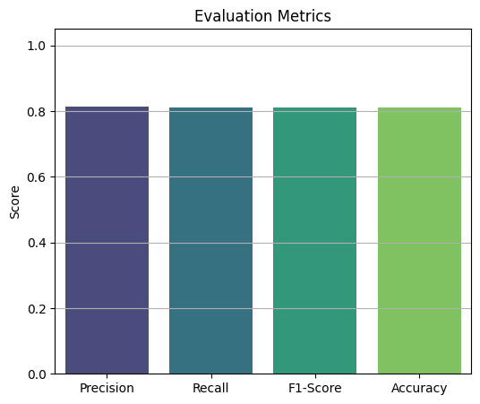

# Fine-Tuning Efficient, Scalable, and Trainable MobileNet Model on CIFAR-10 and Oxford Pets Datasets Using TensorFlow

This project demonstrates how to fine-tune a pre-trained MobileNet model on the CIFAR-10 dataset and then re-fine-tune the resulting model on the Oxford-IIIT Pet dataset for multi-class image classification tasks. The model is exported for both standard and edge deployments using TensorFlow and TensorFlow Lite.

---

## 📚 Datasets

### CIFAR-10 Dataset
- **Description**: 10-class dataset of small images.
- **Total Images**: 60,000 (50,000 training + 10,000 test)
- **Image Size**: 32x32x3

### Oxford-IIIT Pet Dataset
- **Description**: 37-class dataset of pet images (dogs and cats).
- **Total Images**: 7,349 (approx.)
- **Image Size**: Varied (resized to 160x160 or 224x224 for MobileNet)

---

## 🧠 Model Architecture

### Base Model
- **Model Used**: MobileNetV2
- **Pre-trained On**: ImageNet
- **Trainable Layers**: Enabled during fine-tuning
- **Input Shape**: Resized input for compatibility (96x96x3)

---

## 🔁 Step-by-Step Workflow

### 1. Fine-Tune MobileNet on CIFAR-10
- Load MobileNetV2 without the top layer (`include_top=False`)
- Freeze the base model initially, except the last few layers.
- Add a custom classifier head for 10 classes
- Train on CIFAR-10 dataset
- Unfreeze part of the base model for fine-tuning
- Evaluate on test data

#### 1. Data Sample
- 

#### 2. Evaluation Metrics
- 
- 
- 

#### 3. Export Model
- Save as:
  - TensorFlow `.h5` format
  - TensorFlow Lite `.tflite` format (quantized for edge deployment)

#### 4. Load and Predict
- Load the saved model and perform predictions on new CIFAR-10 samples

#### 5. Predictions

  
  
  

---

### 2. Fine-Tune on Oxford-IIIT Pets Dataset
- Load the fine-tuned CIFAR-10 model
- Replace the classification head to support 37 classes
- Re-train the model on the Pet dataset
- Fine-tune the base model further to adapt to the new domain

#### 1. Data Sample
- 

#### 2. Evaluation Metrics
- 
- 
- 

#### 3. Export Model
- Save as:
  - TensorFlow `.h5` format
  - TensorFlow Lite `.tflite` format (quantized for edge deployment)

#### 4. Load and Predict
- Load the saved model and perform predictions on new CIFAR-10 samples

#### 5. Predictions

  
  
  

---

### 📊 Training Insights Table

### 🧠 Fine-Tuning Training Insights

| Metric               | 1st Fine-Tune (CIFAR-10)                            | 2nd Fine-Tune (Oxford-IIIT Pet)                        |
|----------------------|----------------------------------------------------|--------------------------------------------------------|
| Dataset              | CIFAR-10                                           | Oxford-IIIT Pet                                        |
| Trained On           | GPU                                                | CPU                                                    |
| Total Images (Split) | 60,000 (Train: 58%, Val: 25%, Test: 16.7%)         | 7,349 (Train: 70%, Val: 20%, Test: 10%)                |
| Model                | MobileNetV2                                        | MobileNetV2                                            |
| Accuracy             | 0.8121                                             | 0.7717                                                 |
| Loss                 | 0.5436                                             | 0.7733                                                 |
| Training Time (sec)  | 326.24                                             | 761.60                                                 |
| Precision            | 0.8133                                             | 0.7795                                                 |
| Recall               | 0.8121                                             | 0.7717                                                 |
| F1 Score             | 0.8121                                             | 0.7678                                                 |

---

## 📦 Outputs

- `mobilenet_cifar10.h5`
- `mobilenet_cifar10.tflite`
- `mobilenet_pets.h5`
- `mobilenet_pets.tflite`

---

## 🛠️ Tools & Frameworks

- TensorFlow 2.x
- TensorFlow Datasets
- Keras API
- TensorFlow Lite Converter

---

## 🚀 Notes

- Data preprocessing includes normalization and resizing.
- Efficient training with callbacks (e.g., `EarlyStopping`, `ModelCheckpoint`).
- Quantization aware conversion used for `.tflite` models.

---

## 🚧 Further Work

- Edge deployment models tested on low-resource devices.

---